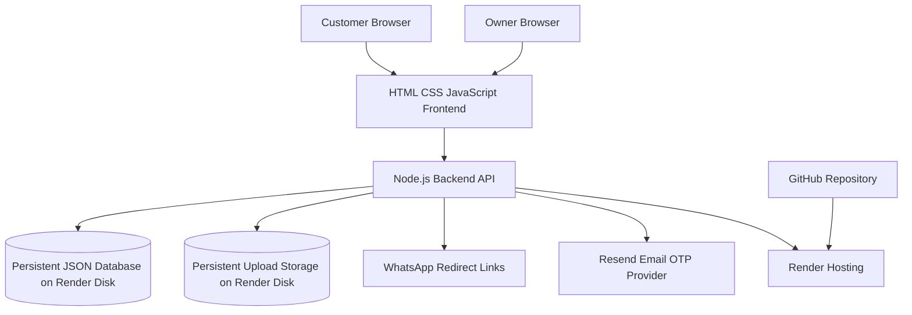
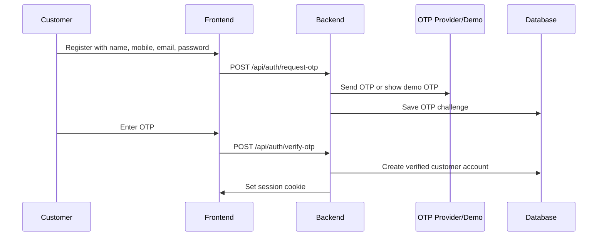
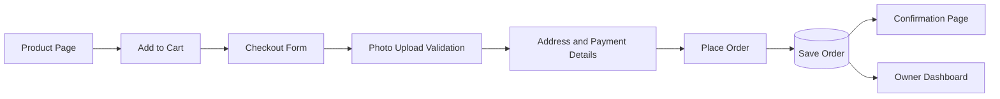
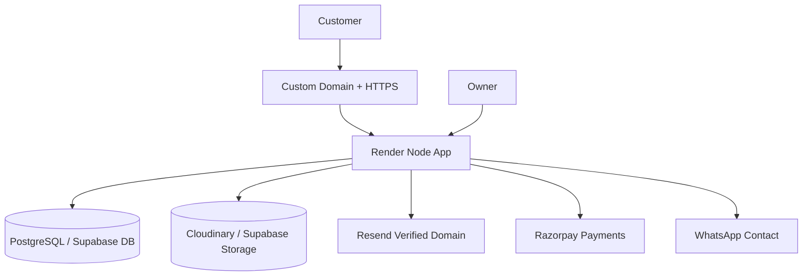

# Karimnagar Frames - Full System Design

## 1. Project Goal

Karimnagar Frames is a custom gift ecommerce website for selling photo frames, printed cups, pillows, coasters, magic mugs, mini frames, and gift combos.

The system allows customers to:

- Browse products
- Register/login with mobile number and password
- Verify account using OTP
- Add products to cart
- Upload product photos
- Place orders
- Track previous orders
- Contact the owner through WhatsApp

The owner can:

- Login with protected owner credentials
- View all orders
- View customer accounts and previous orders
- Search customers by mobile number/name/email/address
- View uploaded photos
- Update order/payment status
- Manage products from owner dashboard

## 2. High-Level Architecture



## 3. Main Modules

### Frontend

Location: `public/`

Main pages:

- `index.html` - homepage, products, cart, checkout
- `product.html` - product detail page
- `auth.html` - login, register, forgot password, OTP
- `customer-dashboard.html` - customer order history
- `owner-dashboard.html` - owner orders, customers, messages
- `owner-products.html` - owner product management
- `confirmation.html` - order confirmation

Main scripts:

- `public/app.js` - homepage, products, cart, checkout, uploads
- `public/product.js` - product detail and add-to-cart logic
- `public/auth.js` - login/register/OTP/password reset
- `public/dashboard.js` - owner/customer dashboard logic
- `public/owner-products.js` - product management logic

### Backend

Location: `server.js`

Responsibilities:

- Serve static frontend files
- Handle authentication and sessions
- Handle OTP registration and password reset
- Manage cart per logged-in user
- Place and store orders
- Save uploaded photos
- Generate WhatsApp order links
- Provide owner dashboard APIs
- Manage product catalog
- Serve sitemap and health check

### Data Storage

Current production storage:

- Database file: `/var/data/db.json`
- Uploads folder: `/var/data/uploads`
- Hosted on Render persistent disk

Important stored data:

- Users
- Sessions
- Carts
- Orders
- Uploaded photo URLs
- Product data
- Contacts/messages
- Owner dashboard data

This prevents orders/photos from disappearing after redeploys.

## 4. Authentication Design

### Customer Account Flow



Current live behavior:

- OTP channel is configured as email through Resend.
- Resend requires a verified domain before sending to all customers.
- Until domain verification is done, `SHOW_DEMO_OTP=TRUE` is enabled so account creation still works.

### Owner Login

Owner credentials:

- Owner ID: `karimnagarframes`
- Password: private owner password already configured

Owner-only APIs require admin session protection.

## 5. Cart and Checkout Design

### Cart Rules

- Guest users cannot add to cart or checkout.
- If not logged in, user is redirected to `auth.html`.
- Cart is stored server-side for the logged-in user.
- Cart survives refresh, logout/login, and redeploy.

### Order Flow



Order stores:

- Order ID
- User ID
- Customer name
- Customer mobile number
- Email
- Address
- Product items
- Customization options
- Uploaded photo URLs
- Quantity
- Total price
- Payment method/status
- Order status
- Timestamp

## 6. Photo Upload System

Photo uploads are product-specific.

Each product can define:

- Minimum photo count
- Maximum photo count
- Upload labels
- Custom fields
- Size/color/options

Examples:

- Cup printing: one customer photo
- Double-side pillow: front photo and back photo
- Collage frame: multiple photos

Photos are compressed/optimized in browser, sent to backend, stored in persistent upload storage, and linked inside the order record.

## 7. Product Management Design

Owner dashboard includes product management.

Owner can:

- Add products
- Edit product name
- Edit price
- Edit description
- Edit images
- Edit sizes/colors/options
- Edit custom fields
- Edit required photo count
- Disable/delete products

Product changes are stored in the database and reflected on the public website.

## 8. Owner Dashboard Design

Owner dashboard contains:

- Order management
- Customer account list
- Previous orders
- Search by mobile/name/email/address
- Payment status updates
- Order status updates
- Uploaded photo previews
- WhatsApp contact buttons
- Product management link

Owner order statuses:

- Pending
- Accepted
- Printing
- Shipped
- Delivered
- Cancelled

Payment statuses:

- Pending
- Awaiting Confirmation
- Paid
- Failed
- Refunded
- Cancelled

## 9. WhatsApp Integration

The system generates WhatsApp URLs for:

- Customer sending order details to owner
- Owner contacting customer directly

Owner number:

- `9032428063`

Order WhatsApp message includes:

- Order ID
- Customer name
- Phone number
- Product items
- Total amount
- Payment status
- Uploaded photo links
- Notes

## 10. Payment Design

Current payment flow:

- Pay on Delivery
- UPI after Preview
- Pay at Store

The system stores payment method and payment status.

Future upgrade:

- Razorpay payment gateway
- UPI QR checkout
- Payment webhook verification
- Auto update payment status

## 11. Deployment Design

Current deployment:

- GitHub repository
- Render web service
- Render persistent disk
- Node.js backend
- Static frontend served by backend

Important environment variables:

```text
HOST=0.0.0.0
DATA_FILE=/var/data/db.json
UPLOAD_DIR=/var/data/uploads
OTP_CHANNEL=email
EMAIL_PROVIDER=resend
OTP_EMAIL_FROM=Karimnagar Frames <onboarding@resend.dev>
RESEND_API_KEY=secret
SHOW_DEMO_OTP=TRUE
```

After Resend domain verification:

```text
OTP_EMAIL_FROM=Karimnagar Frames <otp@yourdomain.com>
SHOW_DEMO_OTP=false
```

## 12. SEO and Google Indexing

Implemented:

- `sitemap.xml`
- Public product URLs
- Google Search Console connection
- Product pages indexable

Recommended:

- Buy custom domain
- Add Google Business Profile
- Add Instagram link
- Add product schema markup
- Add better meta descriptions per product

## 13. Security Design

Implemented:

- Password hashing
- Session cookies
- Owner/admin route protection
- Login required before cart/order
- Guest checkout blocked
- Upload file type validation
- Upload size limits
- Secure headers
- Private database file

Needs future improvement:

- Move from JSON DB to PostgreSQL/Supabase for larger scale
- Add rate limiting for OTP/login
- Add CSRF protection for forms
- Add real payment webhook verification
- Turn off demo OTP after email domain verification

## 14. Current Known Limitation

Real email OTP is not fully production-ready until a custom domain is verified in Resend.

Current live workaround:

- Demo OTP is enabled so customers can register and place orders.

Production fix:

- Buy a domain
- Verify it in Resend
- Change sender email to verified domain
- Disable demo OTP

## 15. Future Production Architecture

Recommended final version:



This future version would be stronger for:

- More orders
- Better speed
- Safer storage
- Real email OTP
- Real online payments
- Better backups

